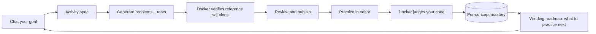

<h1 align="center">Codemm</h1>

<p align="center">
  A local-first programming tutor: chat your goal, practice verified activities, watch your mastery roadmap grow.
</p>

<p align="center">
  <a href="./docs/ARCHITECTURE.md"><strong>Architecture</strong></a>
  ·
  <a href="./docs/codemm-architecture-review.md"><strong>Architecture Review</strong></a>
  ·
  <a href="./docs/TROUBLESHOOTING.md"><strong>Troubleshooting</strong></a>
  ·
  <a href="./CONTRIBUTING.md"><strong>Contributing</strong></a>
</p>

<p align="center">
  
  
  
  
</p>

<p align="center">
  
</p>

**Stop practicing random problems. Practice the concept you are weakest at, and prove it.**

Coding practice tools are everywhere. That is not the hard part.

The hard part is knowing what to practice next, and knowing whether you actually got better.

Generated exercises are often broken or unverifiable.
Solving a problem once says nothing about mastery.
Progress lives in your head, not in the tool.
Your data lives on someone else's server.

Codemm is not a problem bank. It is a local learning loop.

It turns a short chat into a verified activity — every problem ships with a test suite and a reference solution that was actually executed in a Docker sandbox before you ever see it. Your submissions are judged in the same sandbox, every graded attempt updates a deterministic per-concept mastery model, and your roadmap shows exactly which concept to work on next.

The LLM proposes. Deterministic code verifies, grades, and decides mastery. Nothing about your progress is a vibe.

## What Codemm does

Codemm runs entirely on your machine as a desktop app: an Electron shell, a local engine (SQLite + Docker judge), and a chat-driven UI.

One loop, end to end:

| Stage | What happens | Who decides |
| --- | --- | --- |
| **Chat** | Describe what you want to practice; Codemm builds an activity spec through short follow-ups. | LLM proposes, schema validates |
| **Generate** | Problems, test suites, and reference solutions are generated per slot. | LLM proposes |
| **Verify** | Reference solutions must pass their own tests in Docker; weak test suites are rejected by a strength gate. | Deterministic |
| **Review** | Preview each problem with difficulty badges; adjust with AI edit; publish. | You |
| **Practice** | Solve in a built-in editor; run and check against the test suite in the sandbox. | Deterministic |
| **Master** | Every graded attempt moves per-concept mastery (bounded, deterministic). The roadmap reorders around your weakest concept. | Deterministic |



Languages: **Java, Python, C++, SQL**.

## Install

Requirements:

* Node.js 22 or newer, npm
* Docker Desktop — required to verify and judge code; without it Codemm still opens in browse-only mode
* One model source (see below)

Run from source:

```bash
git clone https://github.com/iignaite/Codemm.git
cd Codemm
npm install
npm run dev
```

On first launch, pick a workspace folder. Then choose a model in **LLM Settings**.

Package a desktop build:

```bash
npm run dist:mac    # or dist:win / dist:linux
```

## Choose your model

Codemm needs one LLM for generation and chat. Three ways in, in order of quality:

| Option | Cost | Privacy | Quality |
| --- | --- | --- | --- |
| **Your cloud key** (OpenAI / Anthropic / Gemini) | paid | prompts leave your machine | best |
| **Free Gemini key** from Google AI Studio — no credit card | free | prompts leave your machine | good |
| **Local Ollama** — one click installs and probes a model sized to your RAM | free | fully local | depends on your hardware |

Codemm routes model roles by measured capability, not by trust: a local model that fails the structured-output probe is treated as weak regardless of its size, and generation degrades gracefully — hard problems step down to medium, topics narrow, and partial results are kept for resume — instead of failing outright.

## The learning loop in practice

<p align="center">
  
</p>

Chat until the spec is ready, then generate. Each problem is verified before you see it: the reference solution must pass the test suite in Docker, and a strength gate rejects suites that the starter code already passes.

<p align="center">
  
</p>

Practice in the built-in editor. **Run** executes your code; **Check** grades it against the test suite. Both happen inside a locked-down container — network disabled, read-only filesystem, memory/CPU/process limits.

Every graded check updates your per-concept mastery: a bounded, deterministic update toward your observed pass ratio. Passing once nudges you up; a lucky guess cannot jump you to mastered. The **Roadmap** turns that into a winding trail of concept stops — weakest first, your next stop glowing at the top.

## Local-first by design

Codemm has no accounts, no sign-in, and no cloud backend.

* All durable state lives in your workspace: `<workspace>/.codemm/codemm.db` (SQLite) — threads, activities, submissions, run logs, learner profile, and per-concept mastery.
* API keys are encrypted at rest with Electron `safeStorage`, never shown to the renderer, and never written to workspace files.
* The engine has no HTTP server at all: the UI reaches it only through an allowlisted IPC bridge, so there is no local port for another process or website to attack.
* If you use a cloud model, your prompts and generated code go to that provider — and only there. Local Ollama keeps everything on the machine.

## Security model

Untrusted code — generated reference solutions and your own submissions — only ever runs inside Docker:

* `--network none`, read-only root filesystem, size-capped tmpfs scratch
* memory, CPU, and process-count limits injected at a single choke point, so no runner can forget them
* wall-clock timeouts and output-size kills
* schema validation with size caps on every IPC boundary

Details in [docs/SECURITY.md](./docs/SECURITY.md).

## What Codemm is not

Codemm is not:

* a SaaS or a community platform — there are no accounts and nothing to share
* a problem bank — every activity is generated for you and verified before you practice it
* an AI grader — grading is test execution, and mastery is arithmetic; the LLM never decides either
* a code runner without guardrails — nothing executes outside the sandbox
* finished — see the [architecture review](./docs/codemm-architecture-review.md) for the honest state of things

## Development

```bash
npm run test:unit          # backend unit suite
npm run test:integration   # e2e generation (stubbed LLM + judge), DB, IPC boundary
npm run build              # contracts + backend + frontend production build
npm run lint               # frontend eslint
```

| You changed | Run first | Run before commit |
| --- | --- | --- |
| Backend TypeScript | `npm run test:unit` | `npm run build && npm run test:integration` |
| Generation pipeline or judge | `npm run test:integration` | `npm run build` and the language e2e suites |
| Frontend | `npm run lint` | `npm run build:frontend` |
| Database migrations | migration tests in `apps/backend/test/integration/database` | `npm run test:integration` |

Real-provider smoke tests are key-gated: export a provider key and `CODEMM_RUN_REAL_PROVIDER_SMOKE=1`.

Environment overrides for development (ports, workspace, DB path, Ollama install URLs) are documented in [docs/TROUBLESHOOTING.md](./docs/TROUBLESHOOTING.md).

## Documentation

* [Architecture](./docs/ARCHITECTURE.md) — processes, boot sequence, packaging
* [Architecture review](./docs/codemm-architecture-review.md) — the living audit: verdicts, evidence, what's next
* [IDE-first model](./docs/architecture/IDE_FIRST.md) — state ownership and topology
* [Local LLM orchestration](./docs/architecture/LOCAL_LLM_ORCHESTRATION.md) — the one-button Ollama control plane
* [Security notes](./docs/SECURITY.md)
* [Troubleshooting](./docs/TROUBLESHOOTING.md)
* [Contributing](./CONTRIBUTING.md)

## Star History

<p align="center">
  <a href="https://www.star-history.com/?repos=iignaite%2FCodemm&type=date&legend=top-left">
   <picture>
     <source media="(prefers-color-scheme: dark)" srcset="https://api.star-history.com/chart?repos=iignaite/Codemm&type=date&theme=dark&legend=top-left" />
     <source media="(prefers-color-scheme: light)" srcset="https://api.star-history.com/chart?repos=iignaite/Codemm&type=date&legend=top-left" />
     
   </picture>
  </a>
</p>

## License

[MIT](LICENSE)
