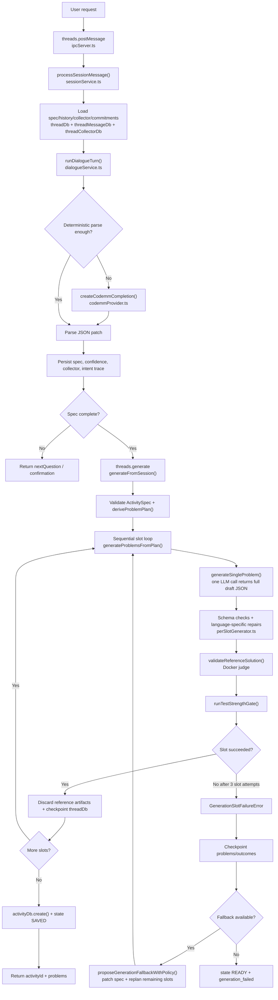

# V1 Agent Workflow (`07f136a52e5bab02e45f90c1b26f849224d87864`)

- `processSessionMessage()` builds context from persisted thread state, then `runDialogueTurn()` either uses deterministic parsing or calls the LLM once to produce a partial spec patch.
- `generateFromSession()` runs only after the spec is complete and valid, then calls `deriveProblemPlan()` once and processes slots sequentially.
- `generateSingleProblem()` is the main agent step: one prompt returns the full draft, including tests and hidden reference artifacts, before Docker validation.
- Failure handling is slot-centric: `generateProblemsFromPlan()` retries a slot up to 3 times and can pass repair context back into `generateSingleProblem()`.
- Session-level fallback happens as soon as one slot hard-fails: `generateFromSession()` can patch the spec, replan, and continue from checkpointed successful slots.
