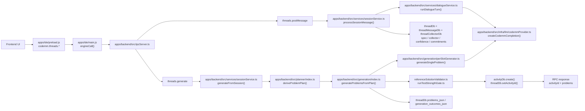

# V1 Architecture (`07f136a52e5bab02e45f90c1b26f849224d87864`)

- `apps/ide/preload.js` and `apps/ide/main.js` are a thin IPC bridge; backend entry is `apps/backend/src/ipcServer.ts`.
- Conversation logic is centralized in `apps/backend/src/services/sessionService.ts::processSessionMessage()` and calls `apps/backend/src/services/dialogueService.ts::runDialogueTurn()`.
- Generation logic is also centralized in `apps/backend/src/services/sessionService.ts::generateFromSession()`, which derives the plan and drives `apps/backend/src/generation/index.ts`.
- Each slot is generated by one LLM call in `apps/backend/src/generation/perSlotGenerator.ts::generateSingleProblem()`, then validated in Docker by `apps/backend/src/generation/referenceSolutionValidator.ts`.
- State lives in thread tables plus checkpointed `problems_json` / `generation_outcomes_json`; final output is an `activityDb.create()` write after reference artifacts are discarded.
