# V2 Agent Workflow (`1f41fbc33caa4a982e7572a4b77ea3799a31cbff`)

```mermaid
flowchart TD
  A["User request"] --> B["threads.postMessage<br/>ide/ipc/threads.js"]
  B --> C["main.js resolves llmRoutePlan<br/>and sends RPC context"]
  C --> D["ipcServer.ts -> withResolvedLlmSnapshot()"]
  D --> E["processSessionMessage()<br/>threadConversationService.ts"]
  E --> F["Load spec/history/collector/commitments<br/>threadRepository + threadMessageRepository"]
  F --> G["runDialogueTurn()<br/>dialogueService.ts"]
  G --> H{"Deterministic parse enough?"}
  H -- "No" --> I["createCodemmCompletion(role='dialogue')"]
  I --> J["Parse JSON patch"]
  H -- "Yes" --> J
  J --> K["Persist spec, confidence, collector, intent trace"]
  K --> L{"Spec complete?"}
  L -- "No" --> M["Return nextQuestion / confirmation"]
  L -- "Yes" --> N["threads.generate or threads.generateV2"]

  N --> O["generateFromThread()<br/>threadGenerationService.ts"]
  O --> P["ExecutionEngine prepare step<br/>validate spec, deriveProblemPlan(), create run rows"]
  P --> Q["generateProblemsFromPlan()<br/>orchestrator.ts"]
  Q --> R["Concurrent slot workers"]
  R --> S["runSlotPipeline()<br/>slotStages.ts"]
  S --> T["generateSkeleton()<br/>createCodemmCompletion(role='skeleton')"]
  T --> U["generateTests()<br/>createCodemmCompletion(role='tests')"]
  U --> V["generateReference()<br/>createCodemmCompletion(role='reference')"]
  V --> W["validateDraftWithTelemetry()<br/>Docker + quality gate"]
  W --> X{"Validation passed?"}
  X -- "Yes" --> Y["Checkpoint problems/outcomes + slot run state"]
  X -- "No" --> Z["generateReference(role='repair')<br/>repair reference only"]
  Z --> AA["Revalidate repaired reference"]
  AA --> AB{"Repair passed?"}
  AB -- "Yes" --> Y
  AB -- "No" --> AC["Terminal slot failure<br/>RETRYABLE/HARD/QUARANTINED"]

  Y --> AD["Return slotResults to generateFromThread()"]
  AC --> AD
  AD --> AE{"All slots failed?"}
  AE -- "Yes and fallback allowed" --> AF["proposeGenerationFallbackWithPolicy()<br/>patch spec + rerun plan once"]
  AF --> Q
  AE -- "No" --> AG["Persist activityRepository + final thread state<br/>COMPLETED / INCOMPLETE / RETRYABLE_FAILURE / HARD_FAILURE"]
  AG --> AH["Return activityId + runId"]
```

- Request routing now has a planner layer before the backend agent runs: `apps/ide/main.js` chooses a per-request route plan, and `createCodemmCompletion()` reads it by role.
- Generation is stage-based, not slot-retry-based: `slotStages.ts` runs `skeleton -> tests -> reference -> validate -> repair` instead of regenerating the whole slot up to 3 times.
- Tool usage is split: LLM stages are role-scoped calls, while Docker validation and the quality gate run in `validateDraftWithTelemetry()` with persistent telemetry.
- Memory/state propagation is broader but less direct: thread state, run state, slot state, and diagnostics are all persisted, and slots can run concurrently.
- Failure handling is narrower at runtime: after Docker failure, v2 repairs only the reference artifact, and session-level fallback runs only when `allFailed` is true.
