# V2 Architecture (`1f41fbc33caa4a982e7572a4b77ea3799a31cbff`)

```mermaid
flowchart LR
  UI["Frontend UI"] --> PRELOAD["apps/ide/preload.js<br/>codemm.threads.*"]
  PRELOAD --> EIPC["apps/ide/ipc/threads.js"]
  EIPC --> MAIN["apps/ide/main.js<br/>engineCall() + resolveLlmRoutePlanForMethod()"]
  MAIN --> IPC["apps/backend/src/ipcServer.ts<br/>withResolvedLlmSnapshot()"]

  IPC --> POST["threads.postMessage"]
  POST --> CONV["apps/backend/src/services/threads/threadConversationService.ts<br/>processSessionMessage()"]
  CONV --> DIALOGUE["apps/backend/src/services/dialogueService.ts<br/>runDialogueTurn()"]
  DIALOGUE --> LLM["apps/backend/src/infra/llm/codemmProvider.ts<br/>createCodemmCompletion(role)"]
  IPC --> SNAP["apps/backend/src/infra/llm/executionContext.ts<br/>AsyncLocalStorage route snapshot"]
  SNAP --> LLM
  CONV --> TMEM["threadRepository + threadMessageRepository<br/>spec / collector / confidence / intentTrace"]

  IPC --> GENREQ["threads.generate / threads.generateV2"]
  GENREQ --> GEN["apps/backend/src/services/threads/threadGenerationService.ts<br/>generateFromThread()"]
  GEN --> ENGINE["ExecutionEngine + createExecutionContext()"]
  ENGINE --> PLAN["apps/backend/src/planner/index.ts<br/>deriveProblemPlan()"]
  PLAN --> ORCH["apps/backend/src/generation/orchestrator.ts<br/>generateProblemsFromPlan()"]
  ORCH --> PIPE["apps/backend/src/pipeline/slotStages.ts<br/>runSlotPipeline()"]
  PIPE --> STAGES["skeleton.ts -> tests.ts -> reference.ts -> validate -> repair"]
  STAGES --> LLM
  PIPE --> DOCKER["referenceSolutionValidator.ts<br/>runTestStrengthGate.ts"]
  GEN --> RUNS["generationRunRepository + generationSlotRunRepository<br/>runRepository + runEventRepository"]
  DOCKER --> ACT["activityRepository.create()/update()"]
  RUNS --> OUT["RPC response<br/>activityId + runId + diagnostics-ready state"]
  ACT --> OUT
```

- `apps/ide/main.js` now resolves an LLM route plan per request and sends it into `apps/backend/src/ipcServer.ts`, which binds it with `withResolvedLlmSnapshot()`.
- Conversation logic moved into `apps/backend/src/services/threads/threadConversationService.ts`; generation moved into `apps/backend/src/services/threads/threadGenerationService.ts`.
- `apps/backend/src/generation/orchestrator.ts` is now a coordinator; real slot execution lives in `apps/backend/src/pipeline/slotStages.ts` and stage prompt modules.
- State is split across thread state plus run/slot telemetry repositories, so generation is observable and resumable but more coupled to persistence.
- `apps/backend/src/ipc/threads.ts` labels `threads.generate` as `"v1"` and `threads.generateV2` as `"v2"`, but both call the same `generateFromThread()` path.
